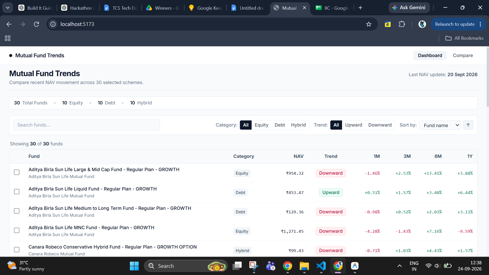
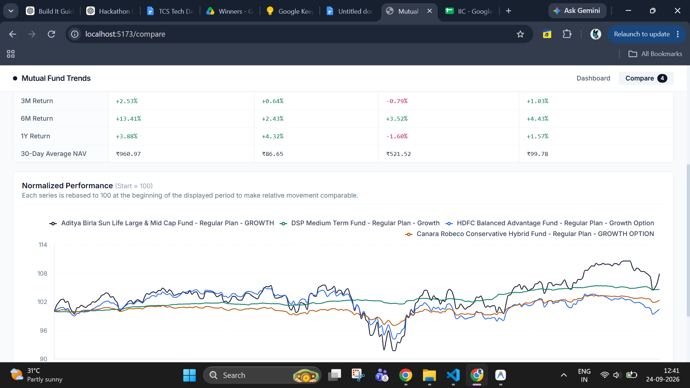

<div align="center">

# 📈 Mutual Fund Trend Dashboard

### Mutual fund data collection, trend analysis, and interactive comparison dashboard

<p>
A complete data-to-dashboard pipeline that fetches public mutual fund NAV data, cleans and categorizes schemes, extracts explainable trends, calculates historical returns, and presents the results through a responsive React dashboard.
</p>

<br/>


</div>

---

## ✨ Overview

The **Mutual Fund Trend Dashboard** transforms raw public mutual fund NAV data into an easy-to-understand analytical dashboard.

The project covers the complete workflow:

```text
Public Mutual Fund Data
        ↓
Data Collection
        ↓
Scheme Selection
        ↓
Cleaning & Validation
        ↓
Trend Extraction
        ↓
Return Calculation
        ↓
Frontend JSON
        ↓
Interactive Dashboard
```

The final dataset contains:

| Category  |  Funds |
| --------- | -----: |
| Equity    |     10 |
| Debt      |     10 |
| Hybrid    |     10 |
| **Total** | **30** |

Each selected fund contains approximately **one year of historical NAV data**.

---

## 🖥️ Dashboard Preview

### Dashboard

> Add your dashboard screenshot here.

```md

```

### Fund Details

> Add your fund detail screenshot here.

```md

```

### Fund Comparison

> Add your comparison page screenshot here.

```md

```

---

## 🚀 Key Features

### 📊 Mutual Fund Dashboard

* Browse all selected mutual funds
* Search by scheme name or fund house
* Filter by category
* Filter by trend direction
* Sort by NAV and historical returns
* View latest NAV values
* Compare fund performance at a glance

### 📈 Trend Analysis

Each scheme is classified as:

* **Upward**
* **Downward**

using a simple and explainable **30-day moving average rule**.

### 🔎 Fund Detail View

Each fund includes:

* Current NAV
* Latest NAV date
* Fund house
* Category and subcategory
* 1-month return
* 3-month return
* 6-month return
* 1-year return
* 30-day moving average
* Historical NAV chart

### ⚖️ Side-by-Side Comparison

Users can compare **2–4 funds simultaneously** using:

* Category
* Fund house
* Current NAV
* Trend
* Historical returns
* Moving average
* Normalized NAV performance

### 💾 Persistent Comparison

Selected funds are stored using browser `localStorage`, so comparison choices remain available after refresh.

---

## 🧠 How the Project Works

```text
mfapi.in
   │
   ▼
fetch_funds.py
   │
   ▼
schemes.json
   │
   ▼
select_funds.py
   │
   ▼
selected_funds.json
   │
   ▼
fetch_history.py
   │
   ▼
fund_history.json
   │
   ▼
clean_data.py
   │
   ▼
cleaned_funds.json
   │
   ▼
calculate_metrics.py
   │
   ▼
funds_with_metrics.json
   │
   ▼
prepare_frontend_data.py
   │
   ▼
frontend/src/data/funds.json
   │
   ▼
React Dashboard
```

---

## 🌐 Data Source

Mutual fund data is collected using the public:

### MFAPI

**Website:** https://www.mfapi.in/

The API provides:

* Scheme code
* Scheme name
* Fund house
* Scheme type
* Scheme category
* Historical NAV

No API key or authentication is required.

---

## 🔍 Fund Selection Logic

The raw API contains thousands of active, inactive, historical, dividend, IDCW and duplicate scheme variants.

The project therefore applies a selection pipeline before analysis.

A fund is considered eligible when:

* sufficient historical NAV data exists
* the latest NAV is recent
* its category can be mapped to Equity, Debt or Hybrid
* it belongs to a supported Growth variant
* IDCW / dividend variants are excluded
* there is reasonable diversity across fund houses

The final selection contains:

```text
10 Equity
10 Debt
10 Hybrid
───────────
30 Funds
```

---

## 🗂️ Category Mapping

The original `scheme_category` returned by MFAPI is preserved.

For the dashboard, categories are normalized into three broader groups:

```text
Contains "Equity"
      ↓
    Equity


Contains "Debt"
      ↓
     Debt


"Income"
      ↓
     Debt


Contains "Hybrid"
      ↓
    Hybrid
```

This allows simpler filtering while retaining the original subcategory information.

---

## 📈 Trend Methodology

The project intentionally uses a simple trend rule rather than a forecasting model.

For every fund:

1. Take the latest NAV
2. Calculate the average NAV over the previous 30 calendar days
3. Compare the latest NAV with the moving average

### Trend Rule

```text
Latest NAV ≥ 30-Day Average
            ↓
         Upward


Latest NAV < 30-Day Average
            ↓
        Downward
```

This keeps the trend definition:

* transparent
* reproducible
* explainable
* easy to validate

---

## 📊 Return Calculation

Historical returns are calculated using:

```text
                Current NAV - Historical NAV
Return (%) = ───────────────────────────────── × 100
                      Historical NAV
```

The dashboard calculates:

| Metric | Period   |
| ------ | -------- |
| 1M     | 30 days  |
| 3M     | 90 days  |
| 6M     | 180 days |
| 1Y     | 365 days |

Because mutual fund NAV values are not available on every calendar day, the pipeline uses the closest available NAV on or before the required historical date.

---

## ⚖️ Normalized Fund Comparison

Raw NAV values should not be directly interpreted as relative performance.

For example:

```text
Fund A NAV = ₹700
Fund B NAV = ₹80
```

The larger NAV does **not** mean Fund A performed better.

Therefore the comparison chart rebases every selected fund to:

```text
Starting Value = 100
```

The calculation used is:

```text
                       Current NAV
Normalized Value = ─────────────────── × 100
                       Starting NAV
```

This makes relative movement easier to compare visually.

---

## 🛠️ Tech Stack

### Data Pipeline

<p>


</p>

### Frontend

<p>


</p>

### Storage

<p>

</p>

---

## 📁 Project Structure

```text
mutual-fund-trend-dashboard/
│
├── data-pipeline/
│   │
│   ├── data/
│   │   ├── raw/
│   │   │   ├── schemes.json
│   │   │   ├── selected_funds.json
│   │   │   └── fund_history.json
│   │   │
│   │   └── processed/
│   │       ├── cleaned_funds.json
│   │       ├── funds.json
│   │       └── funds_with_metrics.json
│   │
│   ├── config.py
│   ├── fetch_funds.py
│   ├── inspect_funds.py
│   ├── select_funds.py
│   ├── fetch_history.py
│   ├── clean_data.py
│   ├── calculate_metrics.py
│   ├── prepare_frontend_data.py
│   ├── test_history.py
│   ├── test_metrics.py
│   └── requirements.txt
│
├── frontend/
│   │
│   ├── src/
│   │   ├── components/
│   │   │   ├── compare/
│   │   │   ├── dashboard/
│   │   │   ├── fund/
│   │   │   └── layout/
│   │   │
│   │   ├── data/
│   │   │   └── funds.json
│   │   │
│   │   ├── hooks/
│   │   ├── pages/
│   │   ├── utils/
│   │   ├── App.jsx
│   │   ├── index.css
│   │   └── main.jsx
│   │
│   ├── package.json
│   └── vite.config.js
│
├── .gitignore
└── README.md
```

---

# ⚙️ Getting Started

## 1. Clone the Repository

```bash
git clone https://github.com/nupoor-mahajan/mutual-fund-trend-dashboard.git
```

```bash
cd mutual-fund-trend-dashboard
```

---

# 🐍 Data Pipeline Setup

## 2. Navigate to the Pipeline

```bash
cd data-pipeline
```

## 3. Create a Virtual Environment

```bash
python -m venv venv
```

### Windows

```bash
venv\Scripts\activate
```

## 4. Install Dependencies

```bash
pip install -r requirements.txt
```

---

## 5. Fetch Mutual Fund Schemes

```bash
python fetch_funds.py
```

Output:

```text
data/raw/schemes.json
```

---

## 6. Select Eligible Funds

```bash
python select_funds.py
```

Expected result:

```text
Equity: 10
Debt: 10
Hybrid: 10
Total: 30
```

Output:

```text
data/raw/selected_funds.json
```

---

## 7. Download Historical NAV

```bash
python fetch_history.py
```

Output:

```text
data/raw/fund_history.json
```

---

## 8. Clean the Dataset

```bash
python clean_data.py
```

Output:

```text
data/processed/cleaned_funds.json
```

---

## 9. Calculate Metrics

```bash
python calculate_metrics.py
```

Output:

```text
data/processed/funds_with_metrics.json
```

---

## 10. Generate Frontend Data

```bash
python prepare_frontend_data.py
```

Output:

```text
frontend/src/data/funds.json
```

---

# 🧪 Dataset Validation

Test NAV history:

```bash
python test_history.py
```

Test calculated metrics:

```bash
python test_metrics.py
```

Expected distribution:

```text
Total Funds: 30

Equity : 10
Debt   : 10
Hybrid : 10
```

---

# ⚛️ Frontend Setup

Open another terminal:

```bash
cd frontend
```

Install dependencies:

```bash
npm install
```

Start development server:

```bash
npm run dev
```

Vite will display the local development URL.

---

## Production Build

```bash
npm run build
```

---

# 🖥️ Application Views

## Dashboard

The dashboard contains:

* Fund search
* Category filter
* Trend filter
* Sorting
* Current NAV
* Historical returns
* Trend status
* Comparison selection

---

## Fund Detail

Each fund page includes:

```text
Scheme Name
Fund House
Category
Current NAV
Latest NAV Date
Trend
30-Day Moving Average
1M Return
3M Return
6M Return
1Y Return
Historical NAV Chart
```

---

## Compare Funds

Users can compare between:

```text
2–4 mutual funds
```

Comparison includes:

* Fund house
* Category
* NAV
* Trend
* Returns
* Moving average
* Normalized performance chart

---

# 💾 localStorage

The frontend uses `localStorage` only to preserve selected comparison funds.

The actual mutual fund dataset remains inside:

```text
frontend/src/data/funds.json
```

No database or backend is required.

---

# ⚠️ Assumptions

* Public mutual fund data is sufficient for the assignment scope.
* The dashboard analyzes 30 representative schemes instead of the entire mutual fund universe.
* Equity, Debt and Hybrid are used as the primary browsing categories.
* Growth-oriented schemes are preferred to avoid duplicate payout variants.
* IDCW and dividend variants are excluded.
* Historical NAV is used for descriptive trend analysis.
* Missing values are shown as `N/A`.
* The trend label is not an investment recommendation.

---

# 🚧 Limitations

* Expense ratio is not included because it is not reliably available through the selected NAV source.
* AUM is not included.
* Benchmark performance is not included.
* Fund ratings are not included.
* Risk scores are not generated.
* Data is refreshed through the Python pipeline rather than directly from the frontend.
* The trend logic is descriptive, not predictive.
* Public API requests may occasionally time out.

---

# 🔮 Future Improvements

With more time, the project could include:

* Automated periodic data refresh
* Better ISIN-based duplicate detection
* AUM integration
* Expense ratio integration from a reliable public source
* Benchmark comparison
* More granular category filters
* Unit tests for pipeline calculations
* API response caching
* Additional data quality checks
* Exportable fund comparison reports

---

# 🎯 Why This Approach?

The objective of the project was not to create a forecasting system.

The focus was instead on:

```text
Raw Public Data
      ↓
Reliable Processing
      ↓
Explainable Metrics
      ↓
Clear Trend Logic
      ↓
Useful Visualization
```

This keeps the system simple, transparent and easy to validate.

---

# ⚠️ Disclaimer

> Data displayed in this project is intended solely for analytical and educational demonstration purposes and should not be considered financial or investment advice.

---

<div align="center">

## 👩‍💻 Author

### Nupoor Mahajan

B.Tech Computer Engineering
Shah & Anchor Kutchhi Engineering College

<br/>

[](https://github.com/nupoor-mahajan)

<br/>

**Built with Python, React and real public mutual fund data.**

</div>
